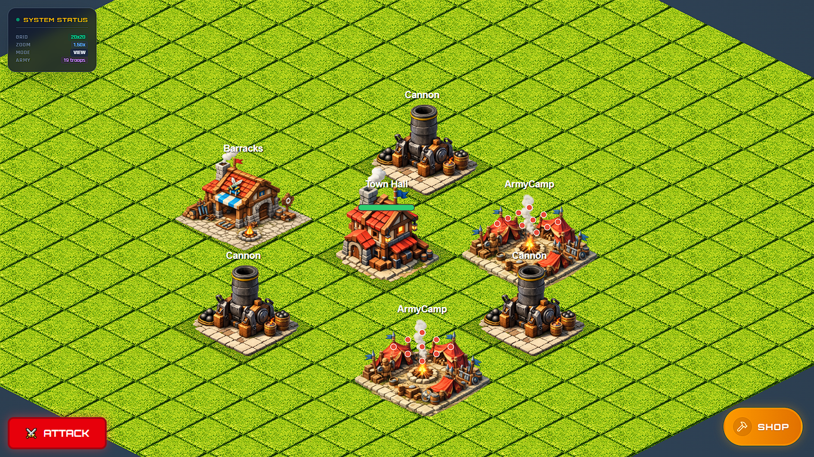
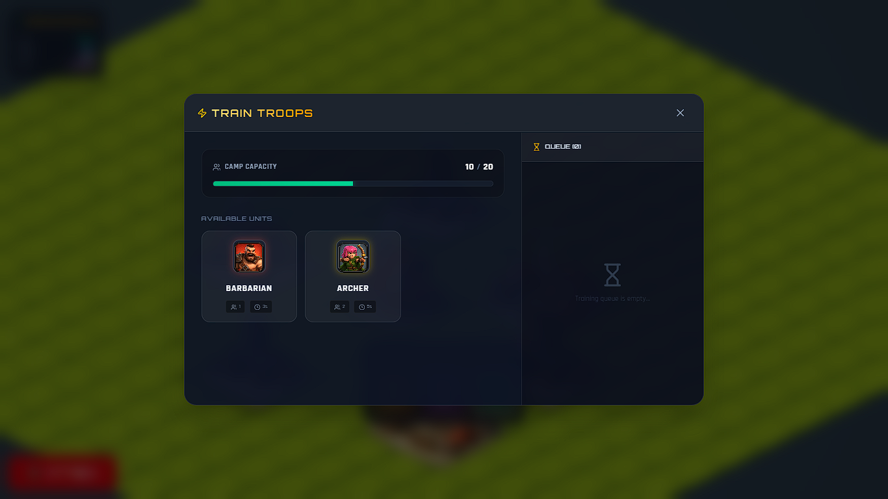
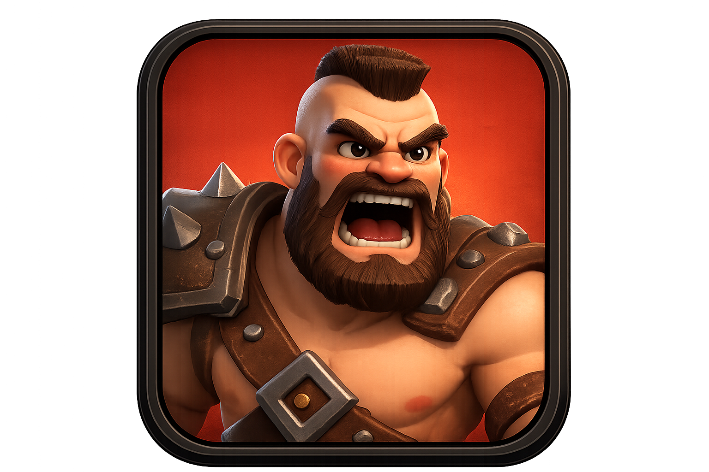
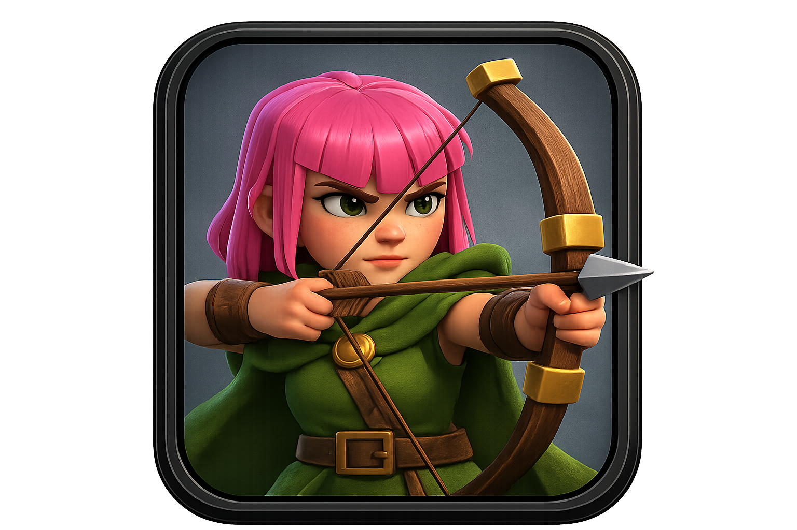

# ⚔️ Clash of Clone

A premium, highly interactive isometric web game clone inspired by *Clash of Clans*, built with React, TypeScript, Vite, and Tailwind CSS. Train your army, upgrade your defenses, and wage war on enemy bases in real-time isometric combat!

---

## 📸 Screenshots

| 🏰 Village view & Gameplay | ⚔️ Barracks Training UI |
|:---:|:---:|
|  |  |

---

## ✨ Features

- **📐 Dynamic Isometric Grid**: Fully responsive diamond-isometric grid with interactive mouse pan and zoom controls.
- **🏗️ Village Building**: Place, select, and reposition critical infrastructure like:
  - **Town Hall**: The heart of your village.
  - **Barracks**: Train specialized combat forces.
  - **Gold Mine**: Passive resource production.
  - **Army Camp**: Host stationed troops in beautiful grid arrays.
  - **Cannon**: Defend your base against enemy invaders.
  - **Wall**: Block and funnel enemy attacks.
- **🛡️ Custom Troop Training**: Train and manage your troops with a queue system:
  - Custom training queues with real-time countdown progress.
  - Interactive cancel options for queue items.
  - Custom unit avatars for **Barbarians** and **Archers**.
- **⚔️ Real-Time Combat Simulation**:
  - Deploy trained forces onto the battlefield.
  - Real-time pathfinding and Target AI: units target the closest buildings automatically.
  - Dynamic defense systems: Cannons fire animated projectiles at attacking troops.
  - Real-time health bars for troops and structures.
  - End-of-battle conditions with a Victory Modal screen.
- **💎 Premium Theme & Aesthetics**: Immersive dark-mode design with glowing indicators, custom typography (Orbitron & Rajdhani fonts), and micro-animations.

---

## ⚙️ Game Infrastructure

### Available Buildings
| Building Type | Width x Height | Description |
| :--- | :--- | :--- |
| **Town Hall** | 4 x 4 | Central command center. |
| **Barracks** | 3 x 3 | Unlocks unit training capabilities. |
| **Army Camp** | 4 x 4 | Increases unit storage capacity. |
| **Gold Mine** | 3 x 3 | Generates and accumulates gold. |
| **Cannon** | 2 x 2 | Shoots at invading ground targets (Range: 7 tiles). |
| **Wall** | 1 x 1 | Sturdy defensive structure. |

### Troops Configurations
| Troop Name | Camp Size | Train Time | Speed | Health (HP) | Avatar |
| :--- | :---: | :---: | :---: | :---: | :---: |
| **Barbarian** | 1 | 3s | 4 | 100 |  |
| **Archer** | 2 | 5s | 5 | 60 |  |

---

## 🛠️ Technology Stack

- **Framework**: [React](https://react.dev/) 18+ (Hooks, Memoization, Custom State Loops)
- **Language**: [TypeScript](https://www.typescriptlang.org/) (Strictly typed configurations, clean interfaces)
- **Build Tool**: [Vite](https://vite.dev/) (Ultra-fast Hot Module Replacement)
- **Styling**: [Tailwind CSS](https://tailwindcss.com/) (Translucent glassmorphism, responsive grids, sleek animations)
- **Icons**: [Lucide React](https://lucide.dev/) (Crisp vector action indicators)

---

## 🚀 Getting Started

Follow these steps to run the game locally:

### 1. Prerequisites
Ensure you have [Node.js](https://nodejs.org/) installed (v18 or higher recommended).

### 2. Clone and Install
Navigate to your project directory and install the required dependencies:
```bash
npm install
```

### 3. Run Development Server
Start the Vite local development server:
```bash
npm run dev
```
Open your browser and navigate to the local host URL shown in your terminal (usually `http://localhost:5173`).

### 4. Build for Production
Generate the optimized production assets inside the `/dist` directory:
```bash
npm run build
```

---

## 🎮 Controls

- **Left Click & Drag**: Pan around the isometric world map.
- **Scroll Wheel**: Zoom in or zoom out of the map.
- **Left Click**: Select buildings to open their actions menu (Train Troops, Info, Move, etc.).
- **Deploy Troops (Attack Mode)**: Click on a troop type card in the bottom deployment bar, then click anywhere on the grass outside the enemy buildings to deploy!
